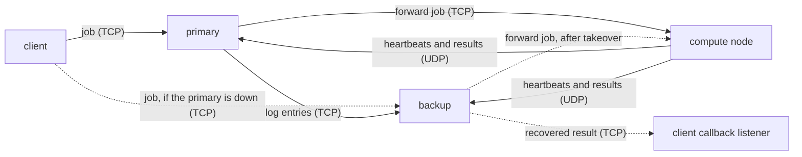

# Clurm

A small cluster job scheduler in C++, with a primary scheduler, a standby backup
that takes over when the primary fails, and compute nodes that run the jobs.

A client sends a job (an executable plus its resource needs) to the primary. The
primary logs it in SQLite, copies the log entry to the backup, picks a compute node
with enough free cores, memory and GPUs, and forwards the job. The compute node runs
the executable and sends the output back. If the primary goes down, the backup
notices within a few health checks, takes over, finishes the jobs the primary had
accepted, and starts accepting new jobs itself.

Everything is written directly on POSIX sockets, threads and SQLite. There are no
other dependencies.

## How it works



### Components

| Program | Role |
|---|---|
| `client/client_app` | Reads a job config, uploads the executable with it, and prints the result. Also listens on a callback port for results the backup recovers. |
| `master/master_app` | Primary scheduler. Assigns ids, logs jobs, copies the log to the backup, and picks compute nodes. |
| `master/backup_app` | Keeps a copy of the primary's job log and watches the primary. Takes over when the primary stops answering. |
| `compute/compute_app` | Runs jobs. Sends a heartbeat with its free resources every 200 ms. |

### The life of a job

1. The client reads a job config and base64-encodes the executable into the request.
   It sends the request to the primary, or to the backup if the primary can't be reached.
2. The primary gives the job a submission id, writes it to `jobs_log` in SQLite, and
   sends the same row to the backup.
3. The primary chooses a compute node from the ones that sent a heartbeat recently.
   A node qualifies if it has enough free cores, memory and GPUs, and among those the
   one with the most capacity wins. The chosen node's resources are reserved until its
   next heartbeat reports the real numbers.
4. The compute node writes the executable to a temp file, runs it, and captures stdout
   and stderr. It sends the result back on the same TCP connection and also sends it
   over UDP to both the primary and the backup.
5. The primary marks the job as answered, tells the backup, and replies to the client.

If the compute node can't be reached, the primary drops it from its list and tries
another node, up to three times.

### Failover

The backup connects to the primary's TCP port at a fixed interval
(`primary_check_interval_ms`). After `primary_failure_threshold` failed checks in a
row, it promotes itself. A client that can't reach the primary also triggers the
backup to check right away.

On promotion the backup:

- Re-reads its job counters from its copy of the log, so new jobs don't reuse ids the
  primary already gave out.
- Goes through the jobs the primary had accepted but not answered:
  - If a compute node already sent the result over UDP, the backup delivers it to
    the client's callback listener.
  - If not, it waits for the job's `time_required`, since the job may still be running.
    If no result has arrived by then, it sends the job to a compute node again and
    delivers that result.
- Accepts new jobs from clients, the same way the primary did.

### Messages

TCP messages are an 8-byte big-endian length followed by a JSON body. The JSON is
read with a small hand-written parser in `common/config_parser.hpp`.

UDP messages are plain text:

| Message | Format |
|---|---|
| Heartbeat | `port:capacity:free_cores:free_memory_mb:free_gpus` |
| Result | `RESULT:<submission_id>:<output>` |

### Storage

The primary and the backup each keep a `jobs_log` table (`master_logs.db` and
`backup_logs.db`):

| Column | Meaning |
|---|---|
| `submission_id` | Job id |
| `job_name`, `sender` | Where the job came from |
| `forwarding_status` | `PENDING`, `FORWARDED`, `FAILED` or `RECOVERED` |
| `response_status` | Output from the compute node, or `PENDING` |
| `client_callback_address`, `client_callback_port` | Where to send a recovered result |
| `forward_payload` | The exact request sent to the compute node, kept so the backup can resend it |
| `delivery_status` | `PENDING` until answered, then `DIRECT`, `DELIVERED` or `UNDELIVERED` |

Compute nodes keep an `execution_log` table in `compute_logs.db` with each job's
state (`RUNNING` or `COMPLETED`), exit code and output.

## Building

You need g++ with C++14 and the SQLite development library. It builds on Linux and
macOS.

```bash
sudo apt install g++ libsqlite3-dev   # Debian or Ubuntu
./build.sh
```

`build.sh` builds the four programs and the sample job in `client/sample_jobs/`.

## Running

The configs in this repo run everything on one machine (127.0.0.1). Start each
program in its own terminal, in this order:

```bash
cd master && ./master_app     # 1. primary
cd master && ./backup_app     # 2. backup
cd compute && ./compute_app   # 3. compute node
cd client && ./client_app     # 4. client
```

Each program reads its config from the folder it runs in. The primary and the backup
share `master/` but write to separate database files.

At the client prompt, enter a job config path:

```
 > Enter config location (or exit to quit): config/config.json
```

The sample job prints the numbers 1 to 5, two seconds apart, so a run takes about
12 seconds.

### Trying a failover

1. Submit `config/config.json` from the client.
2. While it runs, stop the primary with Ctrl+C.
3. The backup prints `Backup is now the active master` within a fraction of a second.
4. When the job finishes, the client prints `Received result after master failover`
   with the job's output.
5. Submit the job again. The client can't reach the primary, sends the job to the
   backup, and gets the next submission id.

## Configuration

### `client/client_config.json`

| Key | Meaning |
|---|---|
| `master_address`, `master_tcp_port` | Primary |
| `backup_address`, `backup_tcp_port` | Backup, used if the primary can't be reached |
| `client_callback_address` | Address the backup uses to send recovered results back |

### Job config (`client/config/config.json`)

| Key | Meaning |
|---|---|
| `name` | Job name |
| `executable` | Path to the executable, relative to `client/` |
| `priority` | Priority |
| `time_required` | Seconds the job needs. After a failover the backup waits this long before running the job again. |
| `min_cores`, `min_memory` | Cores and memory (MB) the job needs |
| `max_memory` | Memory limit (MB) |
| `gpu_required` | GPUs the job needs (optional, default 0) |

### `master/master_config.json`

| Key | Meaning |
|---|---|
| `tcp_address`, `tcp_port` | Where clients connect |
| `udp_address`, `udp_port` | Where compute nodes send heartbeats and results |
| `backup_address`, `backup_tcp_port` | Backup to copy the job log to |
| `backup_connect_timeout_ms` | Timeout when connecting to the backup |
| `heartbeat_timeout_ms` | Drop a compute node after this long without a heartbeat (default 2000) |

### `master/backup_config.json`

| Key | Meaning |
|---|---|
| `tcp_address`, `tcp_port` | Where the primary and clients connect |
| `udp_address`, `udp_port` | Where compute nodes send heartbeats and results |
| `primary_address`, `primary_tcp_port` | Primary to watch |
| `primary_check_interval_ms`, `primary_check_timeout_ms` | How often to check the primary, and the timeout for each check |
| `primary_failure_threshold` | Failed checks in a row before taking over |
| `primary_startup_grace_ms` | Wait this long after starting before the first check |

### `compute/compute_config.json`

| Key | Meaning |
|---|---|
| `compute_address`, `compute_tcp_port` | Where the primary and backup send jobs |
| `master_address`, `master_udp_port` | Primary, for heartbeats and results |
| `backup_address`, `backup_udp_port` | Backup, for heartbeats and results |
| `compute_available_resources` | Capacity score. Each running job uses 20. |
| `compute_free_cores`, `compute_free_memory_mb`, `compute_free_gpus` | Resources this node offers |

To run across several machines, change the addresses in these files.

## Layout

```
client/    client, job config loading, sample job
master/    primary (master.cpp) and backup (backup.cpp), job parsing and forwarding
compute/   compute node, job execution
common/    config parser and base64
build.sh   builds everything
```
